# DigiLog — Application Overview & Flow Diagrams

**Audience:** Client business team + IT team
**Version:** Phase 4 (2026-04-20) — **HISTORICAL SNAPSHOT** (paired with `APPLICATION_FLOW.docx` and the Mermaid `diagrams/`)

> **2026-04-29 update — stack swaps in subsequent windows-friendly-rewrite phases not reflected below:**
> - **Mermaid diagram boxes** (Sections 2 + 5) still show **Nginx**, **Memurai/Redis queue**, and **EMQX MQTT** because the .docx + .png renders match this prose verbatim and would have to be regenerated together. The current install path uses **Fastify-direct on `:3000` (HTTPS via mkcert)**, **graphile-worker on Postgres** for the queue (Phase 2, commit `7832af1`), and **Mosquitto 2.0** for MQTT (Phase 1). The reverse proxy is now optional / customer-choice.
> - **Section 18 ("Permissions, 95 / 82 / 69")** is a release-time snapshot of Phase 4. Current totals are **109 permissions / 91 feature toggles / 81 reauth actions** — verified by `grep -cE "^\s+[A-Z_]+:\s*'" packages/shared/src/types/permissions.ts` etc.
> - **Section 21 (Operations table)** mentions Memurai/EMQX/Nginx/PM2 — **all removed**. Redis/Memurai (2026-05-01), MQTT/EMQX/Mosquitto + TimescaleDB (2026-06), and Nginx + PM2 (Phase 4) are gone; the current stack is PostgreSQL 18 (single `digilog_db`) + one Node process, deployed via the `DigiLog-Setup.exe` installer (registers `DigiLogDB` + `DigiLogAPI` Windows services). See `docs/PHARMA_DEPLOYMENT_21CFR.md`.
>
> For the current architecture refer to root `PROJECT_ARCHITECTURE.md`, `BACKEND_GUIDE.md`, `docs/PHARMA_DEPLOYMENT_21CFR.md`, and `PHASE_5_RECENT_WORK.md` § 12.

---

## 1. What is DigiLog

A 21 CFR Part 11–compliant digital logbook for pharmaceutical / cleanroom environments. It replaces paper logs for:

- Filter **cleaning-cycle tracking** (wash → dry → storage)
- **Preventive-maintenance** scheduling
- **Electronic signatures** and tamper-evident audit trails
- **Offline-capable** tablet operations with automatic sync once connectivity returns

Used on a web browser (admins, supervisors, QA) and on Android tablets (shop-floor operators with RFID scanners).

---

## 2. System at a Glance

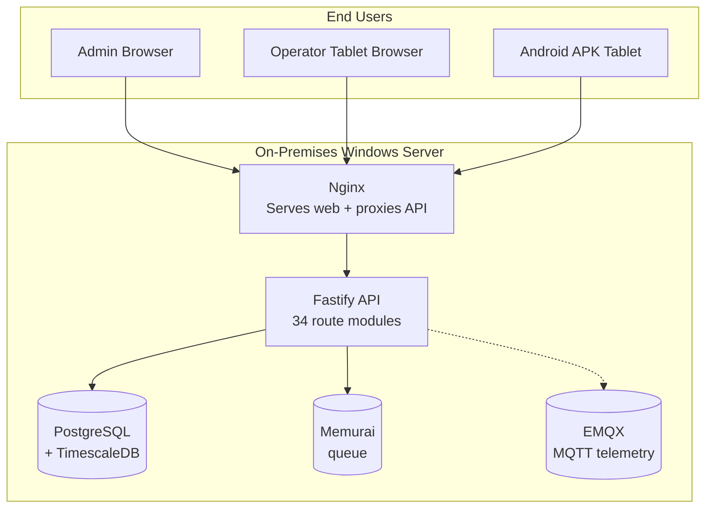

All DigiLog components run on one on-premises Windows server inside the client network.

---

## 3. Who Uses It

| Role | Does what |
|---|---|
| **Admin** | Sets up the system, creates users, defines cleaning profiles, manages configuration |
| **Supervisor** | Approves deviations (bypass / block-change), reviews reports, signs off cycles |
| **Operator** | Scans filters, performs cleaning steps, records readings |
| **Custom roles** | Any bespoke role created by Admin with a custom permission matrix |

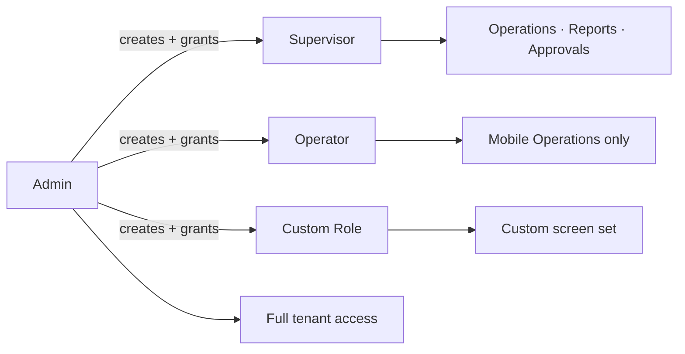

---

## 4. Login

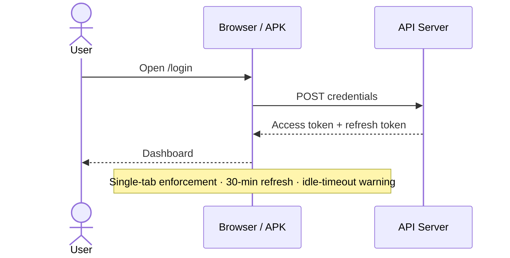

Argon2id password hashing. Optional LDAP. Session tokens in sessionStorage (not localStorage) for shared-workstation safety.

---

## 5. Admin — Initial Setup

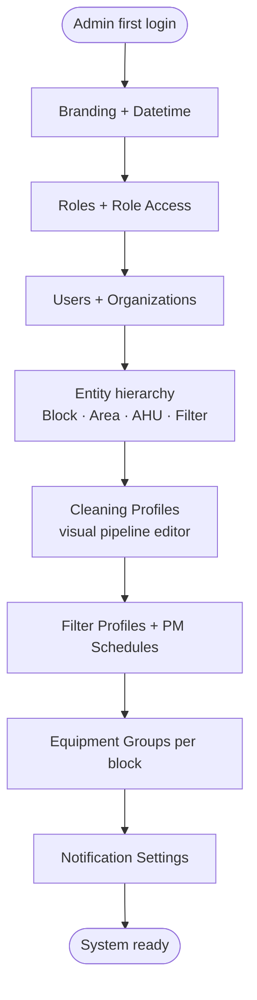

All these are configured through the **Configuration** section of the web UI — no coding needed.

---

## 6. Operator — Day-to-Day Cleaning Cycle

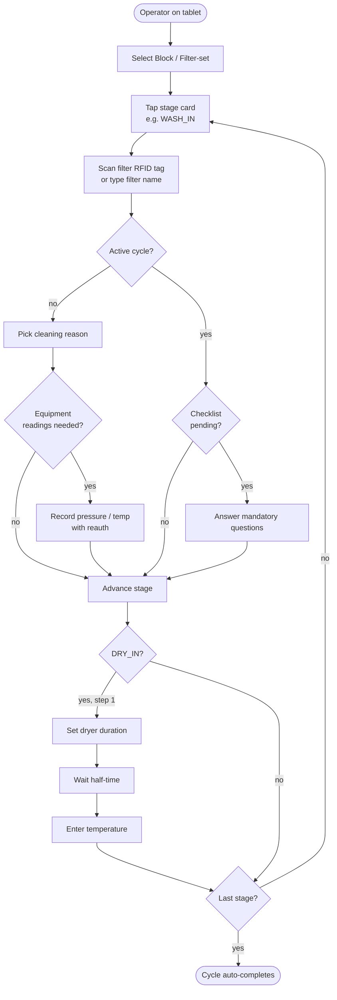

Every action writes a tamper-evident audit event. Sensitive steps require the operator to re-enter their password.

---

## 7. Offline Mode

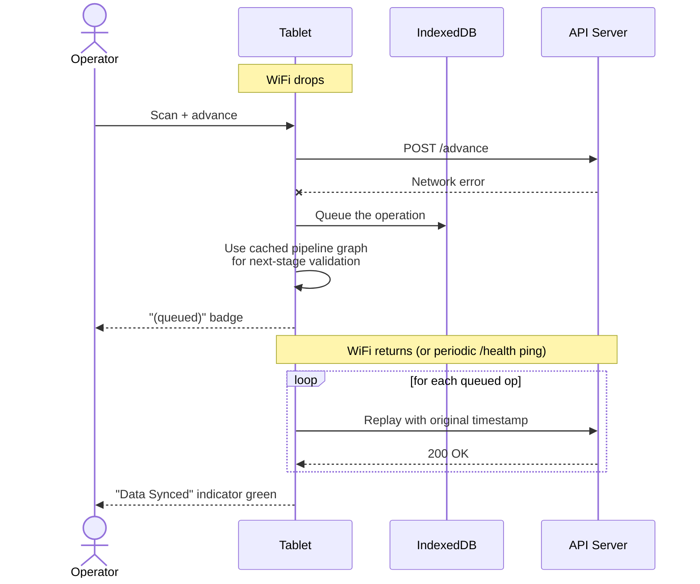

All cached data (filters, pipeline graphs, checklists, equipment groups, RFID map) is pre-loaded while online so the tablet stays fully functional on the shop floor.

---

## 8. Admin Requests & Approvals

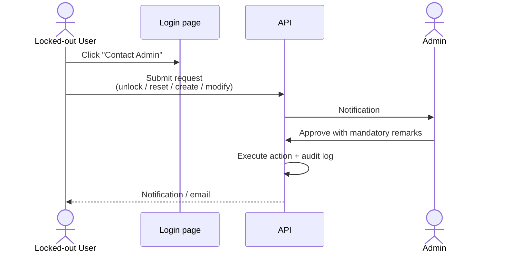

---

## 9. Block-Change Approval (cross-block cleaning)

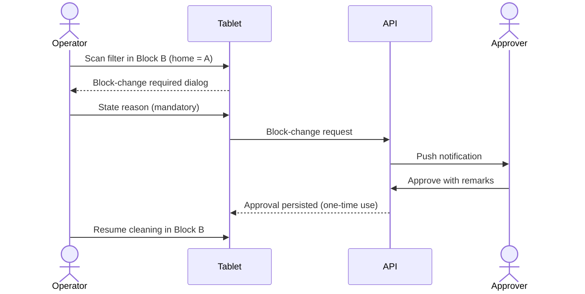

---

## 10. Checklist Enforcement (compliance critical)

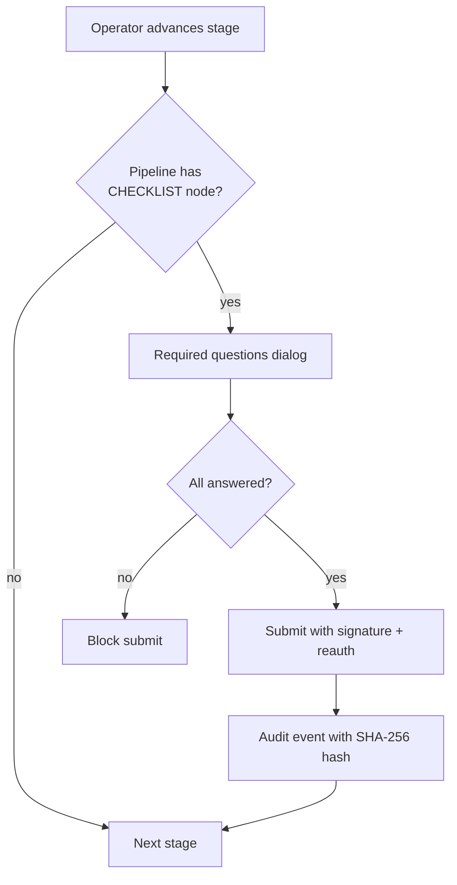

Same enforcement applies offline — required checklists are never skipped.

---

## 11. Reporting

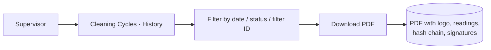

Report layouts (header, footer, records per page) are editable in **Configuration → Report Settings**.

---

## 12. Security & Compliance at a Glance

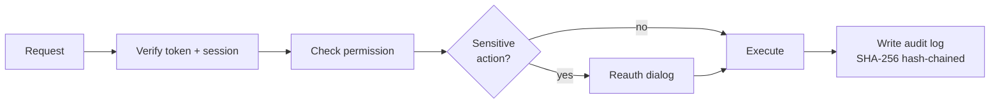

- 95 permissions, 82 feature toggles, 69 reauth actions
- Every mutating action audited — each audit row hashes the previous one, so tampering is detectable end-to-end
- Organization scoping on all queries — tenants cannot see each other's data
- Electronic signatures on checklist submissions

---

## 13. Backup & Restore

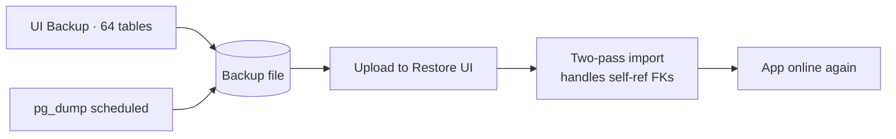

One-click dynamic backup covers all 64 database tables. Restore is two-pass to correctly rehydrate self-referential relationships.

---

## 14. Notifications

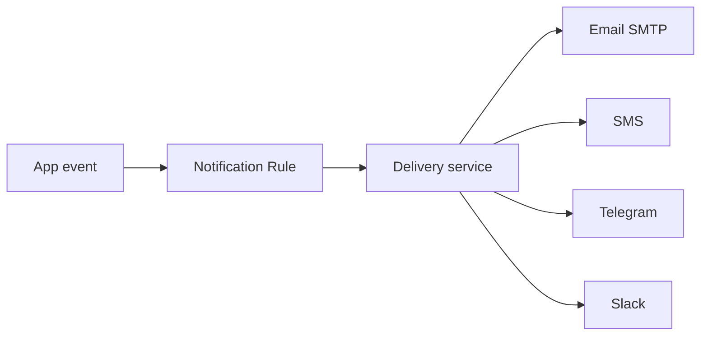

Email, SMS, Telegram, and Slack channels are all configurable per rule. OAuth2 supported for Microsoft / Google email.

---

## 15. A Day in the Life of an Operator

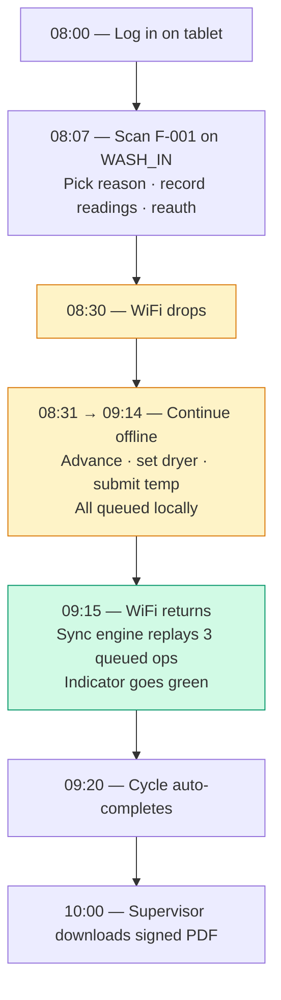

---

## 16. Key Facts for IT

| Item | Value |
|---|---|
| Server | On-premises Windows Server (2019+) |
| Application runtime | Node.js 20+, PostgreSQL 18, Memurai (Redis), EMQX |
| Web access | HTTPS via Nginx (port 443) |
| Default URL | `http://<server>/` |
| Default admin login | `admin / Admin@123` (**rotate on first install**) |
| Backup | Daily — scheduled via Windows Task Scheduler or in-app |
| Logs | PM2 logs + Windows Event Viewer |
| Mobile tablets | Signed Android APK distributed by IT |

---

*End of overview. Full technical detail is available in the development team's internal docs.*
