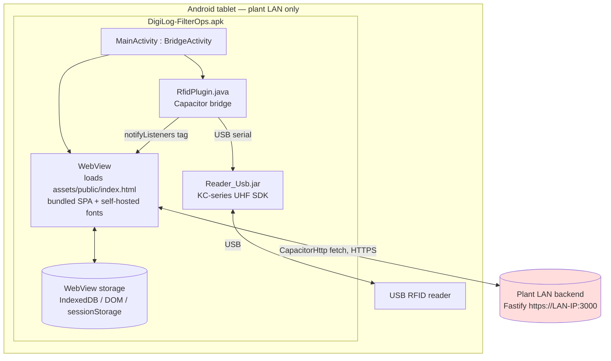

# DigiLog Android (APK) — Offline Deployment & Internet-Dependency Audit

> Assessed against branch `RFID`, 2026-07-25, against actual source, Gradle config,
> AndroidManifest, native Java/Kotlin, bundled libraries, and the **built**
> `DigiLog-FilterOps.apk`. Every claim carries a file/line or command receipt.
> Companion to `docs/OFFLINE-DEPLOYMENT-READINESS.md` (server/web side).

---

## 1. Executive Summary

**`DigiLog-FilterOps.apk` is a thin Capacitor 8 wrapper around the bundled DigiLog
web app. It has NO runtime Internet dependency.** It loads the SPA from assets baked
into the APK (not from a remote URL), talks only to the plant's **local backend
server** over HTTPS on the LAN, and reads RFID tags from a **USB** reader via a
bundled local SDK. There is no Firebase, no Google Play Services, no analytics, no
crash reporting, no push, and no third-party network SDK of any kind.

The single self-hosted-fonts fix (2026-07-25) removed the last external reference in
the web layer, and that fix is now baked into this APK (11 `.woff2` verified inside).

**Final verdict: YES — the APK runs fully offline against a LAN-only backend.** See §13.

Two SDKs/apps were examined:
- **`DigiLog-FilterOps.apk`** (the deployable) — the subject of this report.
- **`rfid_scan_app/`** (a separate, standalone Kotlin/Compose diagnostic scanner) —
  also has no network code; covered in §5/§9.

---

## 2. Android Architecture

| Aspect | Finding | Evidence |
|--------|---------|----------|
| Framework | **Capacitor 8.3** (hybrid WebView), NOT React-Native/Flutter/Cordova-app | `apps/android/package.json:14-17` |
| Languages | TypeScript/React (web) + Java (2 native files) | `MainActivity.java`, `RfidPlugin.java` |
| Web assets | **Bundled inside the APK** — `webDir: '../web/dist'`, copied to `assets/public/` | `capacitor.config.ts:6`; `unzip -l` shows `assets/public/...` |
| WebView entry | `BridgeActivity` loads local `assets/public/index.html`; **no `server.url`** | `MainActivity.java:8`; grep `server.*url` → none |
| Native plugins | `@capacitor/app`, `@capacitor/core`, `@capacitor/network` + custom `RfidPlugin` | `package.json`, `MainActivity.java:13` |
| RFID SDK | `Reader_Usb.jar` (KC-series UHF) via `com.rfid.trans.*`, USB serial mode | `RfidPlugin.java:20-22,135` |
| Local storage | WebView DOM storage + IndexedDB (offline queue/sync); sessionStorage for JWT | `MainActivity.java:27`; web offline-sync engine |
| Background services | **None native.** No `Service`, `WorkManager`, `AlarmManager`, `JobScheduler`, foreground service | grep of native tree — 2 files only |
| Broadcast receivers | One **runtime-registered, non-exported** receiver for USB-permission grant only | `RfidPlugin.java:103-129` |
| USB | USB Host mode → RFID reader | `AndroidManifest.xml:7`, `RfidPlugin.java` |
| Bluetooth / NFC / Camera | **Not used** (no permissions, no APIs) | manifest has none |
| File access | `FileProvider` for share/upload paths | `AndroidManifest.xml:43-51` |

### Architecture diagram



Only **one** arrow leaves the tablet: WebView → the plant's LAN backend. No arrow
reaches the public Internet.

---

## 3. Native Components

- **`MainActivity.java`** — `BridgeActivity`; registers `RfidPlugin` pre-`onCreate`;
  enables mixed content (HTTPS page → allows API) + DOM storage for offline cache
  (`MainActivity.java:24-28`). No network code.
- **`RfidPlugin.java`** — USB-only: `pickRfidDevice()` matches KC-series vendor IDs
  (`{10473,1024,4292,6790,1659}`, `:214`), requests USB permission, `reader.Connect(device, manager, 1)`
  serial mode (`:135`), forwards tags to JS via `notifyListeners("tag", …)` (`:155`).
  **Zero network calls** — no `URL`, `Socket`, `HttpURLConnection`, OkHttp.

---

## 4. Permissions Review (`DigiLog-FilterOps.apk`)

The **entire** manifest permission set is one line:

| Permission / feature | Purpose | Required? | Internet required? |
|----------------------|---------|-----------|--------------------|
| `android.permission.INTERNET` (`AndroidManifest.xml:56`) | Open TCP sockets to reach the **LAN backend** (`https://<plant-IP>:3000`). Android's `INTERNET` permission governs *all* IP sockets, LAN included — its presence is **not** evidence of public-Internet use. | Yes (for LAN API) | **No** — LAN only |
| `uses-feature android.hardware.usb.host` `required=false` (`:7`) | Talk to the USB RFID reader | For RFID | No |

**Not present** (notable absences that confirm the offline posture): `ACCESS_NETWORK_STATE`,
`ACCESS_WIFI_STATE`, `ACCESS_FINE/COARSE_LOCATION`, `BLUETOOTH*`, `CAMERA`, `RECORD_AUDIO`,
`READ/WRITE_EXTERNAL_STORAGE`, `POST_NOTIFICATIONS`, `RECEIVE_BOOT_COMPLETED`,
`FOREGROUND_SERVICE`, `WAKE_LOCK`. (Online/offline detection uses `@capacitor/network`,
which does not require `ACCESS_NETWORK_STATE` on modern APIs.)

`android:usesCleartextTraffic="true"` (`:16`) + `networkSecurityConfig` (`:17`) — see §10.

---

## 5. Third-Party SDK Inventory

| SDK | Present? | Version | Purpose | Runtime Internet | Build-time | Offline OK |
|-----|----------|---------|---------|------------------|-----------|-----------|
| Firebase / FCM (messaging/push) | **NO** | — | — | — | — | ✅ n/a |
| Google Play Services (GMS) | **NO** | — | — | — | — | ✅ n/a |
| Google Maps / Analytics | **NO** | — | — | — | — | ✅ n/a |
| Crashlytics / Sentry / Datadog / App Center / Bugsnag | **NO** | — | — | — | — | ✅ n/a |
| AWS / Azure / Microsoft / Facebook / OneSignal / Twilio / Branch / Mixpanel / Flurry | **NO** | — | — | — | — | ✅ n/a |
| `com.google.gms:google-services` (gradle **classpath**) | Declared but **NOT applied** | 4.4.4 | Would enable FCM *if* `google-services.json` existed — it does **not**, so the plugin is skipped | — | build classpath only | ✅ |
| AndroidX (appcompat, coordinatorlayout, core-splashscreen, core, webkit) | Yes | see `variables.gradle` | UI/WebView runtime | **No** | Maven | ✅ |
| **`Reader_Usb.jar`** (KC-series UHF RFID SDK) | Yes | vendor jar (70 KB) | USB RFID read/write | **No** — USB serial | bundled locally | ✅ |
| Capacitor core/app/network | Yes | 8.x | Hybrid bridge, lifecycle, connectivity | **No** | npm/Maven | ✅ |

**Evidence for "no Firebase":**
```
$ ls app/google-services.json        → ABSENT
build.gradle:47-54 → conditional: applies google-services ONLY if the json exists
Built APK: unzip -l | grep -i 'firebase|gms|play-services|crashlytics' → 0 matches
Native imports grep 'firebase|com.google.android.gms|crashlytics|analytics' → 0 matches
```

---

## 6. External URL Inventory

**Runtime (native + bundled web):** none. The only external URLs that ever existed in
the web bundle were the Google Fonts CDN `<link>`s in `index.html`, **removed and
self-hosted 2026-07-25**. Post-build proof: `grep -rl "googleapis|gstatic" apps/web/dist` → **0**.

| Location | URL | Type | Internet? | Redirectable to LAN? |
|----------|-----|------|-----------|----------------------|
| ~~`index.html:26-28`~~ | ~~`fonts.googleapis.com` / `fonts.gstatic.com`~~ | Fonts | RESOLVED — now `/fonts/fonts.css` (local) | n/a |
| Backend API base | `https://<plant-IP>:3000` (set on-device via `localStorage['digilog.serverUrl']`) | REST | LAN only | Already LAN — operator sets the server IP on the tablet |
| Native code (`RfidPlugin`/`MainActivity`) | — | — | none | — |

No WebSocket, socket, GraphQL, SignalR, MQTT, FTP, or hardcoded public IP/domain exists
in the native layer or the bundled web app.

---

## 7. Runtime Network Communication

| Source | Destination | Protocol / Method | Trigger | Frequency | Required | Redirectable |
|--------|-------------|-------------------|---------|-----------|----------|--------------|
| WebView (`CapacitorHttp`-patched `fetch`) | Plant LAN backend `:3000` | HTTPS — GET/POST/PUT/DELETE | Login, all data ops, offline-queue sync | Per user action + periodic SWR revalidate + JWT refresh (30 min) | Yes | Already LAN (server IP is user-set) |
| `@capacitor/network` | — (OS-local) | — | Connectivity change | On change | For offline UX | n/a — no traffic leaves device |
| `RfidPlugin` ↔ reader | USB (local) | USB serial | Scan | Continuous during inventory | For RFID | n/a |

**Startup makes no outbound request** beyond loading local assets; the first network
call is the user's login to the LAN backend. Nothing contacts the public Internet at
any point.

---

## 8. Build-Time Internet Dependencies (dev machine only — NOT the tablet)

Gradle resolves dependencies from `google()` + `mavenCentral()` (`android/build.gradle:6-7,18`)
and the Android Gradle Plugin 8.13 / `google-services:4.4.4` classpath. This is a
**build-machine** requirement only — identical in nature to `npm install`. The
**installed APK needs none of it**. Build the APK before shipping (or use an offline
Gradle/Maven cache); the plant tablet only ever receives the finished `.apk`.

| Item | Source | When |
|------|--------|------|
| AGP 8.13.0, google-services 4.4.4 | Google Maven | build |
| AndroidX libs (`variables.gradle`) | Google Maven / Maven Central | build |
| Capacitor android libs | Maven / npm | build |
| `Reader_Usb.jar` | **bundled in-repo** (`app/libs/`) | already local |

---

## 9. Offline Functionality Assessment

Device on the plant LAN, **no Internet**:

| Feature | Works offline (LAN)? | Notes |
|---------|----------------------|-------|
| Login | ✅ | JWT against LAN backend |
| Dashboard / all pages | ✅ | Bundled SPA + LAN API |
| RFID scanning (USB) | ✅ | `RfidPlugin` + `Reader_Usb.jar`, no network |
| Barcode/QR scan | ✅ | Web-based, local |
| Sync with local server | ✅ | IndexedDB offline queue → LAN API |
| Report viewing / PDF / Excel | ✅ | Client-side jspdf/exceljs |
| Image upload/download | ✅ | To/from LAN backend `/uploads` |
| Local storage / file ops | ✅ | WebView storage + FileProvider |
| Fonts / visual polish | ✅ | Self-hosted, bundled in APK (11 woff2 verified) |
| **Push notifications** | ❌ **feature absent** | No FCM wired in — never worked, so nothing to lose offline. In-app notifications (LAN) work. |
| Tablet fully disconnected from LAN | ✅ (queues) | Offline sync engine + PWA precache; syncs when LAN returns |

**No feature fails for lack of Internet.** The only Internet-shaped capability (FCM push)
is not built into the app at all.

---

## 10. Security & Network Review (TLS on a LAN)

`res/xml/network_security_config.xml` (referenced at `AndroidManifest.xml:17`):

```xml
<base-config cleartextTrafficPermitted="true">
  <trust-anchors>
    <certificates src="system" />          <!-- system CAs -->
    <certificates src="user" />            <!-- operator-installed customer root CA -->
    <certificates src="@raw/rootca" />     <!-- bundled mkcert rootCA.pem -->
  </trust-anchors>
</base-config>
```

| Check | Finding |
|-------|---------|
| Local HTTPS to LAN backend | ✅ Supported |
| Self-signed / internal CA | ✅ Trusts a **bundled** `@raw/rootca` (`res/raw/rootca.pem` present) **and** the `user` store, so the customer can install their own server root CA on the device |
| Cleartext traffic | Permitted (`usesCleartextTraffic=true` + config) — allows HTTP fallback for dev; production uses HTTPS |
| **Certificate pinning** | **None** — so no pin-set to maintain, and no failure mode tied to it |
| **CRL / OCSP (revocation) Internet dependency** | **None** — standard Android chain validation against the configured trust anchors does **not** perform blocking online revocation checks; there is no OCSP-stapling-required or pinning config. TLS validation is fully offline. |

**Conclusion:** TLS to the plant server works entirely offline. No revocation service,
no online CA, no pinning callback is required.

---

## 11. Native Library Audit

| Library | Vendor | Purpose | Network | Internet | Offline |
|---------|--------|---------|---------|----------|---------|
| `Reader_Usb.jar` (`com.rfid.trans.*`) | KC-series reader OEM | USB UHF RFID read/write | **USB serial only** | No | ✅ |
| AndroidX appcompat / coordinatorlayout / core / core-splashscreen / webkit | Google (AndroidX) | UI + WebView runtime | No | No | ✅ |
| capacitor-android, capacitor-cordova-android-plugins | Ionic | Hybrid bridge | No (bridge only) | No | ✅ |
| Native `.so` shared libraries | — | — | — | — | **0 present** in the built APK |

`Reader_Usb.jar` is USB-only (`reader.Connect/StartRead/StopRead/DisConnect`, callbacks) —
no server communication. Built-APK receipt: `unzip -l DigiLog-FilterOps.apk | grep '\.so$'` → **0**.

---

## 12. Risks

| Risk | Severity | Impact | Mitigation |
|------|----------|--------|------------|
| Operator sets a *public/Internet* API URL on the tablet | Low (config error) | Tablet would try to reach the Internet | Set the LAN server IP in the on-device Server Address; document in runbook |
| Customer root CA not installed on tablet | Medium (setup) | HTTPS to LAN server fails ("Trust anchor not found") | Install the server's `rootCA.pem` on each device (Settings → Security), or rely on the bundled `@raw/rootca` if using the shipped mkcert root |
| Build machine needs Internet to compile | Low | Only affects build, not the tablet | Build before shipping / offline Gradle cache |
| `rfid_scan_app` declares `INTERNET`/`ACCESS_NETWORK_STATE` | Info | Unused — no network code in its source | Cosmetic; can drop the permissions. Separate diagnostic app, not the deployable. |

No **High** risk to offline operation exists.

---

## 13. Final Verdict

> **Can `DigiLog-FilterOps.apk` be deployed and operated inside a client's isolated
> plant network with NO Internet access, talking only to the client's local backend?**
>
> ## ✅ YES.
>
> The APK is a Capacitor shell that loads a **bundled** local SPA (no `server.url`, no
> CDN — fonts self-hosted and verified inside the APK), reads RFID over **USB** via a
> bundled local SDK, and makes its only network calls to the **plant LAN backend** over
> HTTPS. There is **no Firebase, no Google Play Services, no analytics/crash/push SDK,
> no `.so` native lib, and no third-party network library** anywhere in the source or
> the built binary. TLS to the LAN server is validated against system/user/bundled trust
> anchors with **no certificate pinning and no online revocation (CRL/OCSP) dependency**.
> The only Internet-shaped feature (FCM push) is not wired into the app at all, so nothing
> is lost offline.
>
> **The only true Internet requirement is at BUILD time** (Gradle/Maven), which happens
> on the developer's machine — the installed APK needs nothing but the LAN and the USB
> reader.

### If any concern remains, the (non-blocking) items are:
- Ensure the tablet's on-device **Server Address** points at the **LAN** backend IP.
- Ensure the customer **root CA** is installed on the tablet (or use the shipped mkcert root).
- Optionally strip the unused `INTERNET`/`ACCESS_NETWORK_STATE` permissions from the
  standalone `rfid_scan_app` (diagnostic-only app; not the deployable).
