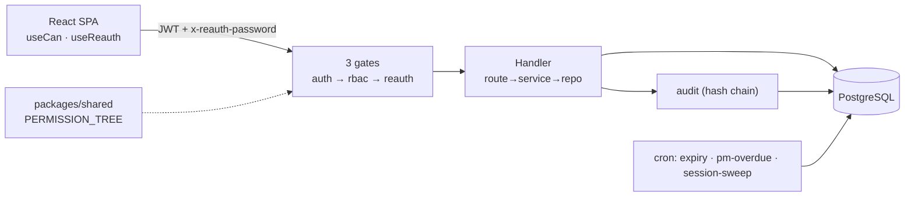
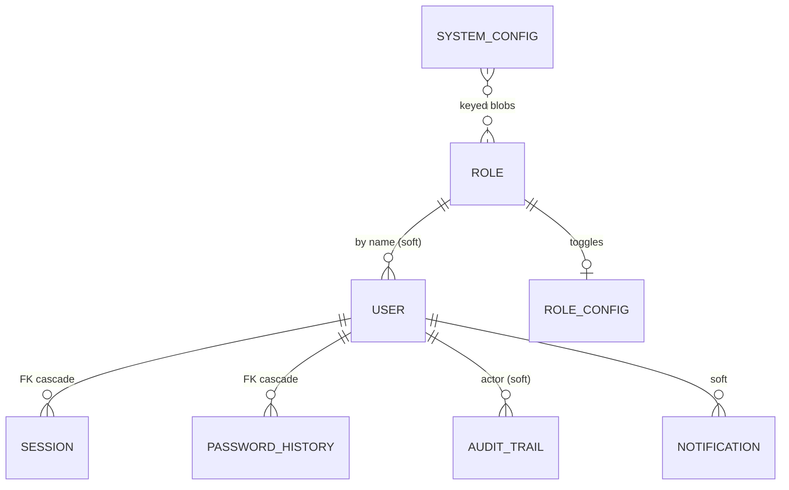
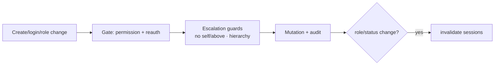
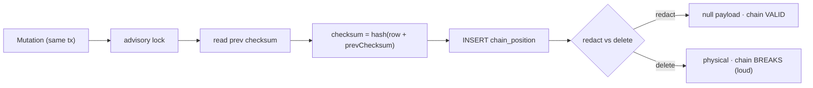
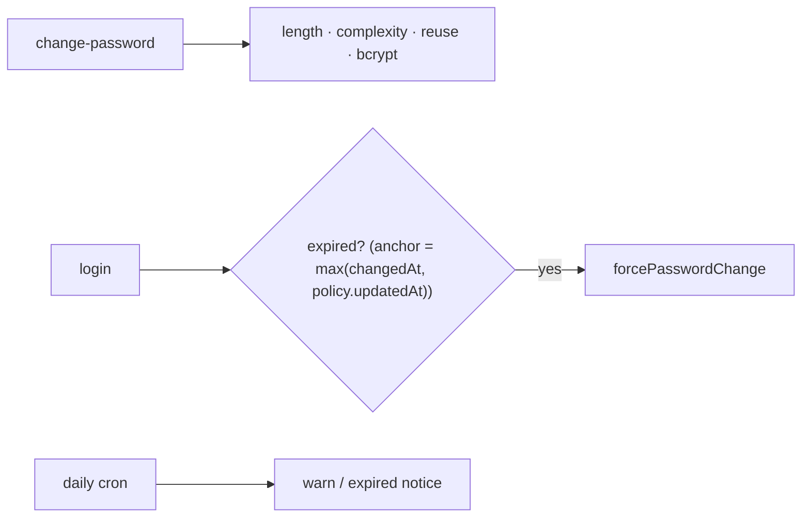
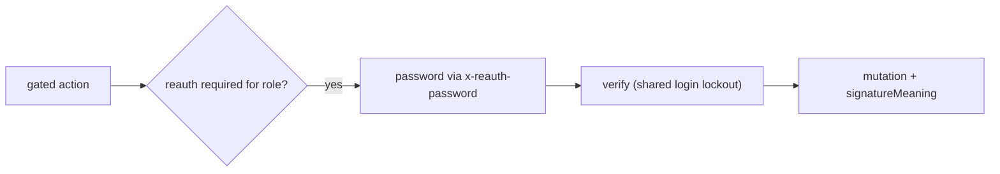
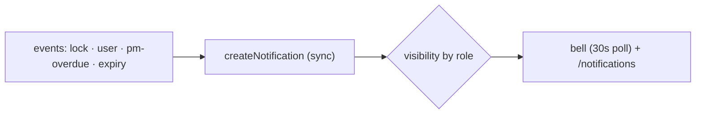
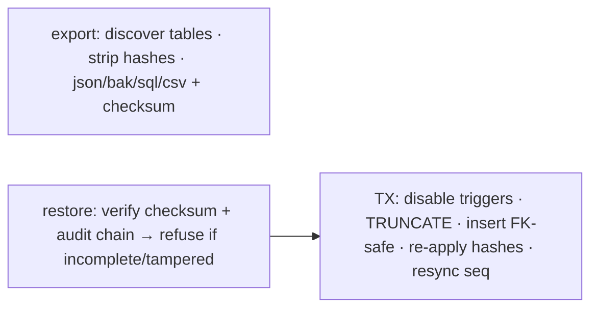
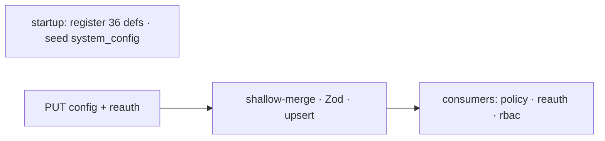
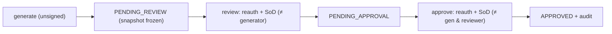

# DigiLog Architecture — Summary (Basic Flows)

**Quick-reference companion.** Basic flow diagrams + the essentials for the 21 CFR Part 11 admin surface.
For full field tables, edge cases and the verification matrix, see **`digilog-architecture.md`**.

- **Stack:** Fastify (TS) · React/Vite SPA · PostgreSQL 18 · graphile-worker
- **Scope:** user management/RBAC, audit trail, password policy, re-auth, notifications, backup/restore,
  configuration, electronic signatures. **Filter-management (FMMS) excluded — separate project.**
- Tiers in diagrams: FE = frontend · BE = backend · DB = database · WK = worker.

---

## System overview

Every call passes three gates, then the handler writes data + a hash-chained audit row in one transaction.

---

## Data model (core links)

Roles join by **name string** (soft); sessions/password-history are **hard FK cascade**; audit actor is a plain
varchar so deleting a user never rewrites history.

---

## 1. User management & RBAC

- **RBAC config = SUPER_ADMIN** (roles, action-reauth, access-matrix). User ops (create/enable/reset) delegatable to ADMIN.
- Two layers: feature toggles → rebuild `roles.permissions`; request-time `hasEffectivePermission` (`_MANAGE`→CRUD).
- Key endpoints: `POST/GET/PUT/DELETE /api/users`, `POST /api/auth/login`, `POST /api/auth/change-password`,
  `GET/PUT/DELETE /api/roles/:name`, `PUT /api/config/roles/:role`.

---

## 2. Audit trail (hash chain)

- Trigger `audit_trail_no_delete` blocks physical deletes; delete endpoints disable it per-tx.
- `GET /api/audit`, `GET /verify-chain` (SA), `POST /:id/redact`, `DELETE /:id` (AUDIT_DELETE).

---

## 3. Password policy & expiry

- Expiry derived live from policy; `policy.updatedAt` grace floor avoids mass lockout.
- `GET /api/config/password-policy/current`, `PUT /api/config/password-policy`, `POST /api/auth/change-password`.

---

## 4. Re-authentication

- `action-reauth` config maps `{ACTION: [roles]}`. `enforceReauthAlways` = unconditional (audit/report signing).

---

## 5. Notifications

- Written synchronously (queue task is a dead drain). Delete requires `NOTIFICATION_DELETE`, audited fail-closed.

---

## 6. Backup & restore

- Ephemeral downloads (no stored model). `BACKUP_RESTORE` must be granted explicitly (not implied by `BACKUP_MANAGE`).
- `GET /api/backup/export`, `POST /api/backup/validate`, `POST /api/backup/restore`.

---

## 7. Configuration

- Def-driven; partial shallow-merge (a tab won't reset other fields); corrupt blob → schema defaults.
- Security/user/notification defs (SA-gated): `roles`, `action-reauth`, `access-matrix`, `audit-templates`,
  `notification-rules/-email/-sms`, `qnn-notifications`; plus `password-policy`, `session`, `login-security`, `user-id`.

---

## 8. Electronic signatures

- Signature = reauth (act) + `signatureMeaning` (intent, in hash chain) + ReportReview `*By/*At` (record).
- **Gaps:** no per-user PKI; `signatureMeaning` not shown in UI; Stage-1 "Printed By" unsigned.
- `POST /api/report-reviews`, `POST /:id/review` (always REVIEW_REPORT), `POST /:id/approve` (always APPROVE_REPORT).

---

## Verification snapshot (verified 2026-07-18, branch RFID)

| Area | Result |
|---|---|
| RBAC counts (102 perms · 83 privileges · 92 reauth · 27 sidebar) | ✅ verified |
| PERMISSION_TREE single source + frozen-snapshot drift lock | ✅ verified |
| Config (36 defs, all routes, 15 user/security/notif defs) | ✅ verified |
| **GAP:** system roles deletable (no `isSystem` guard) | ⚠️ `role.service.ts:346` |
| **GAP:** role-delete skips caller-hierarchy guard | ⚠️ `role.service.ts:346` |
| E-signatures: no per-user PKI; meaning not in UI | ⚠️ known |

---

*Summary of the compliance/admin surface (filter-ops excluded). Full detail: `digilog-architecture.md`.*
