# DigiLog Platform Architecture — Compliance & Administration Surface

**Deep architecture, data-flow & integration reference.** Every endpoint, gate, model field and file path below was
verified against live code on branch `RFID`, 2026-07-18.

| | |
|---|---|
| **Stack** | Fastify (TypeScript, port 3000, HTTPS) · React/Vite SPA (port 5175) · PostgreSQL 18 · graphile-worker |
| **Compliance** | 21 CFR Part 11 |
| **Tenancy** | single-tenant · single-site · single-company (JWT `scope` always `GLOBAL`) |
| **Queue** | graphile-worker (Postgres-backed), single in-process runner — no Redis, no MQTT |

> **Scope.** This document covers the **21 CFR Part 11 compliance & administration surface only**: user management,
> RBAC, audit trail, password policy, re-authentication, notifications, backup/restore, configuration, and
> electronic signatures. **Filter-management / cleaning operations (the core FMMS) are a separate project and are
> deliberately excluded.**

### How to read this

Diagram tiers: **FE** frontend · **BE** backend · **DB** database · **WK** worker/cron · **SEC** security gate.
Diagrams are Mermaid code fences (render on GitHub and most Markdown viewers). Each subsystem section carries: a
flow diagram → a data-model field table → an endpoints table → a step-by-step walkthrough → edge cases/guards →
file paths.

---

## Table of contents

- [A. System architecture & request lifecycle](#a-system-architecture--request-lifecycle)
- [B. Database schema (ER) + relationship semantics](#b-database-schema-er--relationship-semantics)
- [1. User management & RBAC](#1-user-management--rbac)
- [2. Audit trail & tamper-evident hash chain](#2-audit-trail--tamper-evident-hash-chain)
- [3. Password policies & expiry](#3-password-policies--expiry)
- [4. Re-authentication](#4-re-authentication)
- [5. Notifications](#5-notifications)
- [6. Backup & restore](#6-backup--restore)
- [7. Configuration system](#7-configuration-system)
- [8. Electronic signatures](#8-electronic-signatures)
- [9. Verification matrix (auditor proof)](#9-verification-matrix--auditor-proof)
- [10. 21 CFR Part 11 coverage](#10-21-cfr-part-11-coverage)
- [11. Cross-cutting libraries](#11-cross-cutting-libraries)

---

## A. System architecture & request lifecycle

Every authenticated call crosses **three ordered gates** in a Fastify `onRequest` chain before a handler runs, then
the handler reads/writes a single Postgres database and (on any mutation) writes a hash-chained audit row inside the
same transaction. Background sweeps run in a graphile-worker runner embedded in the API process.

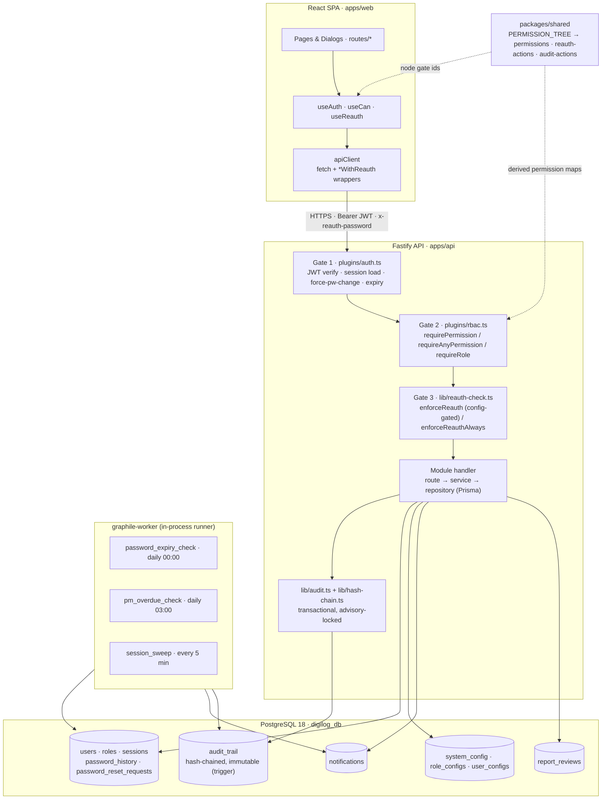

### Request lifecycle, step by step

1. **SPA** attaches the JWT (from `sessionStorage`) as `Authorization: Bearer`. For a gated action it also collects a
   password via `ReauthDialog` and sends it as the `x-reauth-password` header (or `_currentPassword` body field).
2. **Gate 1 — `plugins/auth.ts`** (`onRequest`): verifies the JWT (jose), loads the session + user (30s cache),
   re-patches `role`/`username` from the DB so admin role changes propagate, enforces session expiry (sliding window,
   absolute 24h cap), and — while `forcePasswordChange`/`PASSWORD_EXPIRED` is set — returns **403** on every route
   except a small allowlist (`/api/auth/change-password`, `/logout`, `/me`, `/config/password-policy`,
   `/config/tablet-access/my-features`).
3. **Gate 2 — `plugins/rbac.ts`**: `requirePermission(P)` expands the role's permissions via
   `hasEffectivePermission()` and checks; **SUPER_ADMIN returns early (bypass)**. Role→perms cached 5s.
4. **Gate 3 — `lib/reauth-check.ts`**: if the action is listed for the caller's role in the `action-reauth` config,
   `enforceReauth` requires and verifies the password (same lockout accounting as login). `enforceReauthAlways`
   is unconditional (used by report review/approve).
5. **Handler** runs route → service → repository; the service opens a transaction, performs the mutation, and calls
   `auditLog(entry, tx)` so the audit row commits or rolls back atomically with the business change.

### Caches & invalidation (important for "why didn't my change take effect")

| Cache | TTL | Where | Invalidated by |
|---|---|---|---|
| Role → permissions | 5 s | `rbac.ts:31` | `invalidateRolePermsCache` (role update/delete, role-config save) |
| User + session auth | 30 s | `auth.ts:102` | `invalidateUserAuthCache` / `invalidateSessionAuthCache`; `forcePasswordChange:true` users are **never** cached |
| Password policy | on write | `auth.ts:62` | `invalidatePasswordPolicyCache` on policy PUT |
| action-reauth config | 10 s | `reauth-check.ts` | `invalidateReauthCache` on config save |

> Permission changes bake into the JWT at **login** — a re-grant needs re-login (or the 5s cache expiry) to take
> effect for enforcement; frontend visibility updates on next `/api/auth/me`.

---

## B. Database schema (ER) + relationship semantics

Two link styles coexist and the distinction is load-bearing: **hard FKs** (`ON DELETE CASCADE`) vs **soft links** —
`User.role` → `Role.name` by _string_, and several `userId` columns referencing `users.id` _by convention_ with no
DB FK. `SYSTEM_CONFIG` and `ADMIN_REQUEST` are standalone stores.

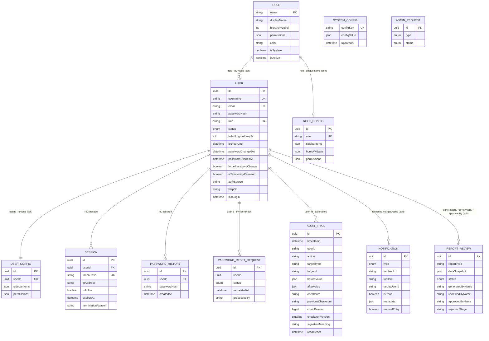

### Relationship reference

| From → To | Card. | Link column | Type |
|---|---|---|---|
| USER → ROLE | many:1 | `users.role` → `roles.name` | soft · by name |
| ROLE_CONFIG → ROLE | 1:1 | `role_configs.role` (unique) | soft · by name |
| USER_CONFIG → USER | 1:1 | `user_configs.userId` (unique) | soft · by convention |
| SESSION → USER | many:1 | `sessions.userId` | **FK · CASCADE** |
| PASSWORD_HISTORY → USER | many:1 | `password_history.userId` | **FK · CASCADE** |
| PASSWORD_RESET_REQUEST → USER | many:1 | `password_reset_requests.userId` | soft · by convention |
| AUDIT_TRAIL → USER (actor) | many:1 | `audit_trail.user_id` (varchar) | soft · **no FK** |
| NOTIFICATION → USER | many:1 | `forUserId` / `targetUserId` | soft · username/id |
| REPORT_REVIEW → USER | many:1 | `generatedBy` / `reviewedBy` / `approvedBy` | soft · uuid, no relation |
| SYSTEM_CONFIG | — | `configKey` (referenced from code) | standalone blob store |
| ADMIN_REQUEST | — | public intake | standalone |

> **Why soft links matter for compliance.** Because the audit actor is a plain `varchar` and roles join by name,
> deleting a role or user does **not** cascade to config or rewrite history — `audit_trail` keeps the original actor
> id forever (§11.10(e)) and the hash chain is never disturbed by identity changes. Backups strip `password_hash`
> from `USER` and `PASSWORD_HISTORY` to a `__BACKUP_STRIPPED__` sentinel and re-apply the real hashes on restore.

---

## 1. User management & RBAC

Four cooperating modules: `users/` (CRUD, enable/disable/unlock, resets), `auth/` (login, JWT, self-service),
`roles/` (role catalog + permission definitions), `config/…/roles.routes.ts` (feature-toggle config that syncs back
into `roles.permissions`). Two privilege-escalation guards bracket every write.

### 1.1 Backend endpoints

**Users** (`modules/users/routes.ts` → `user.service.ts` → `user.repository.ts`)

| Method · Path | Gate | Reauth | Notes |
|---|---|---|---|
| `POST /api/users` | `USER_CREATE` | CREATE_USER | temp password, `forcePasswordChange=true` |
| `GET /api/users` | `USER_READ` | — | hides roles above caller; SA hidden from non-SA |
| `GET /api/users/:id` · `/stats` | `USER_READ` | — | detail / status counts |
| `PUT /api/users/:id` | `USER_UPDATE` | UPDATE_USER | role/status change invalidates sessions |
| `DELETE /api/users/:id` | SUPER_ADMIN | DELETE_USER | SUPER_ADMIN can never be deleted |
| `POST /api/users/bulk-delete` | SUPER_ADMIN · 5/min | BULK_DELETE_USERS | |
| `POST /api/users/:id/enable` · `/disable` | `USER_ENABLE_DISABLE` | ENABLE/DISABLE_USER | disable terminates sessions |
| `POST /api/users/:id/unlock` | `USER_UNLOCK` | UNLOCK_USER | temp password + force change |
| `POST /api/users/:id/reset-password` | `USER_RESET_PASSWORD` | RESET_PASSWORD | admin temp reset |
| `GET /api/users/reset-requests` · `/pending` | `USER_RESET_PASSWORD` | — | self-service queue |
| `POST /api/users/reset-requests/:id/process` | `USER_RESET_PASSWORD` | PROCESS_RESET_REQUEST | approve/reject |
| `POST /api/users/password-expiry-sweep` | `CONFIG_UPDATE` | — | manual expiry sweep |

**Auth** (`modules/auth/routes.ts` → `auth.service.ts`)

| Method · Path | Auth | Notes |
|---|---|---|
| `POST /api/auth/login` | public · 10/min | LDAP auto-provision; session-conflict 409 |
| `POST /api/auth/logout` · `/beacon-logout` | bearer / token | terminate session; sendBeacon on tab-close |
| `POST /api/auth/refresh` | bearer · 30/min | re-issue JWT with fresh role from DB |
| `GET /api/auth/me` | bearer | profile + effective `permissions[]` |
| `PUT /api/auth/profile` | bearer + reauth UPDATE_PROFILE | self profile |
| `POST /api/auth/change-password` | bearer · 5/min | self / first-login change |
| `POST /api/auth/verify` | bearer · 5/min | reauth → 5-min verification token |
| `POST /api/auth/forgot-password` | public · 3/15min | anti-enumeration; creates reset request |
| `POST /api/auth/offline-grant` | bearer + password | HMAC offline-replay grant token (tablets) |

**Roles** (`modules/roles/routes.ts`)

| Method · Path | Gate | Reauth |
|---|---|---|
| `GET /api/roles` | `ROLE_MANAGE` | — |
| `GET /api/roles/active` | public/optional token | — |
| `GET /api/roles/access-matrix` | authenticated | — |
| `GET /api/roles/permissions/all` | `ROLE_MANAGE` | — |
| `POST /api/roles` | `ROLE_MANAGE` | CREATE_ROLE |
| `PUT /api/roles/:name` | `ROLE_MANAGE` | UPDATE_ROLE |
| `DELETE /api/roles/:name` | `ROLE_MANAGE` | DELETE_ROLE |
| `GET /api/roles/:name/creatable` | `USER_CREATE` | — |

**Role/user config** (`config/static-routes/roles.routes.ts`)

| Method · Path | Gate | Reauth |
|---|---|---|
| `GET/PUT /api/config/roles[/:role]` | `CONFIG_READ` / `ROLE_MANAGE` | UPDATE_ROLE_CONFIG |
| `GET/PUT /api/config/users/:userId` | `CONFIG_READ` / `ROLE_MANAGE` | UPDATE_USER_CONFIG |
| `GET /api/config/my-config` | bearer | — |

### 1.2 The two-layer permission model

- **Grant-time expansion.** Feature toggles live in `RoleConfig.permissions` as a `featureId → bool` map. On save,
  `config.service.updateRoleConfig()` rebuilds `Role.permissions` from `FEATURE_TO_PERMISSION_MAP` (derived from
  `PERMISSION_TREE`):
  - **Permissions-tab save** → full rebuild: drop all mapped perms, re-add enabled toggles, preserve non-feature (manual) perms.
  - **Sidebar-tab save** → additive: keep all current perms, add each enabled sidebar item's *primary* perm; never revoke.
  - `reverseMapPermissions()` does the inverse for display (a toggle shows enabled if the role holds **any** mapped perm).
- **Request-time expansion.** `rbac.ts` checks `hasEffectivePermission()`: `MANAGE_PERMISSION_SUFFIXES =
  ['_CREATE','_UPDATE','_DELETE','_VIEW','_READ','_EXPORT']` — a route needing `X_UPDATE` is satisfied by `X_MANAGE`;
  `X_VIEW` is satisfied by `X_READ`. **`_RESTORE` is intentionally excluded** (that is why `BACKUP_MANAGE` grants
  export but not restore).
- **Per-user overrides.** `UserConfig` mirrors `RoleConfig`; `getMyConfig` returns the user override when it has any
  sidebar items or permissions, else the role config (**user override > role config**).

> **RBAC *configuration* is SUPER_ADMIN-only** — the `roles`, `action-reauth`, and `access-matrix` config defs carry
> `requiredRole: SUPER_ADMIN`. User *operations* (create/enable/reset) are delegatable to ADMIN via `USER_*` perms.
> Two distinct layers; do not conflate.

### 1.3 Escalation guards (the security spine)

- **`role.service.assertRoleWithinCallerPrivilege`** — a non-SA cannot: modify their own role; modify/create a role
  at or above their own hierarchy; grant any permission they do not themselves hold (subset check on newly-added
  perms). Enforced on role **create + update**.
- **`user.service.assertCanManageTarget`** — cannot manage a user whose role hierarchy exceeds the caller's; cannot
  change one's own role; create-with-higher-role blocked. Enforced on update/delete/reset/unlock/enable.

### 1.4 Auth flow depth

- **Login** (`auth.service.login`): resolve user (or LDAP auto-provision) → status gates (LOCKED/DISABLED/EXPIRED,
  SUPER_ADMIN auto-recovers) → LDAP bind or bcrypt `verifyPassword` (sentinel hash `LDAP_EXTERNAL_AUTH` denied unless
  LDAP bind ok; a `DUMMY_HASH` compare on unknown users keeps timing constant) → failed-attempt accounting + lockout
  (SA exempt) → password-expiry derivation (may set `forcePasswordChange`) → session-conflict (**409
  `SESSION_CONFLICT`** unless `force:true` terminates the existing session) → create `Session` → `signToken(jose)` →
  audit `LOGIN_SUCCESS`.
- **Sessions**: stored in `sessions`; sliding-window `expiresAt` extension debounced to ≤1 write/60s; absolute 24h
  cap; `terminationReason` records why (`role_changed`, `password_changed`, `disabled`, …). `beacon-logout` handles
  tab close.
- **First-login / temp change** (`auth.service.changePassword`): if `isTemporaryPassword`, no current password
  required; otherwise verified (failures count toward lockout). Validated against live policy, sets
  `passwordExpiresAt`, clears `forcePasswordChange`/`isTemporaryPassword`, terminates other sessions. The 30s cache
  deliberately does not cache `forcePasswordChange:true` users so the flag clears immediately.

### 1.5 Create-user flow

```mermaid
sequenceDiagram
  autonumber
  participant U as SPA /users/create
  participant API as POST /api/users
  participant SVC as userService.create
  participant DB as Postgres
  U->>U: fetch password-policy + roles/:role/creatable; gen policy-compliant temp pw
  U->>API: postWithReauth(payload, x-reauth-password)
  API->>API: requirePermission('USER_CREATE') → enforceReauth('CREATE_USER')
  API->>SVC: Zod createUserSchema
  SVC->>SVC: validateUserId · hierarchy (target ≤ creator) · uniqueness · validatePasswordPolicy · bcrypt
  SVC->>DB: INSERT user (forcePasswordChange=true, isTemporary=true)
  SVC->>DB: addPasswordHistory · auditLog('USER_CREATED') · createNotification(ADMIN) · dispatchNotification
  SVC-->>U: 201 → navigate /users
```

### 1.6 Audit actions emitted

Users: `USER_CREATED/UPDATED/DELETED`, `BULK_USER_DELETED`, `USER_ENABLED/DISABLED`, `ACCOUNT_UNLOCKED`,
`PASSWORD_RESET`, `PASSWORD_RESET_REQUEST_APPROVED/REJECTED`. Auth: `LOGIN_SUCCESS/FAILED`, `ACCOUNT_LOCKED`,
`PASSWORD_EXPIRED`, `FORCED_LOGOUT`, `LOGOUT`, `PROFILE_UPDATED`, `PASSWORD_CHANGED`, `GRANT_OFFLINE_REPLAY`. Roles:
`ROLE_CREATED/UPDATED/DELETED`. Config: `CONFIG_CHANGED` (targetType `role_config`/`user_config`).

### 1.7 Frontend

Pages (all `<RequireRole>`-guarded, button gating via `useCan`): `users/{list,create,edit,reset-requests}.tsx`,
`config/role-access.tsx` (4 tabs: roles / permissions / sidebar / reauth), `config/access-matrix.tsx`. Token in
`sessionStorage`; 30-min refresh; single-tab enforcement via BroadcastChannel.

**Key files:** `apps/api/src/modules/{users,auth,roles}/*` · `plugins/{auth,rbac}.ts` ·
`lib/{reauth-check,jwt,password}.ts` · `packages/shared/src/types/{permission-tree,permissions,reauth-actions}.ts` ·
`apps/web/src/routes/users/*` · `routes/config/role-access.tsx` · `hooks/{use-can,use-reauth}.ts`.

---

## 2. Audit trail & tamper-evident hash chain

Every mutation calls `auditLog(entry, tx?)` inside the business transaction — state never changes without a record
(§11.10(e)). Rows are chained: each checksum binds the row **and its predecessor**, so any in-place edit, insertion
or deletion is detectable.

### 2.1 Write path

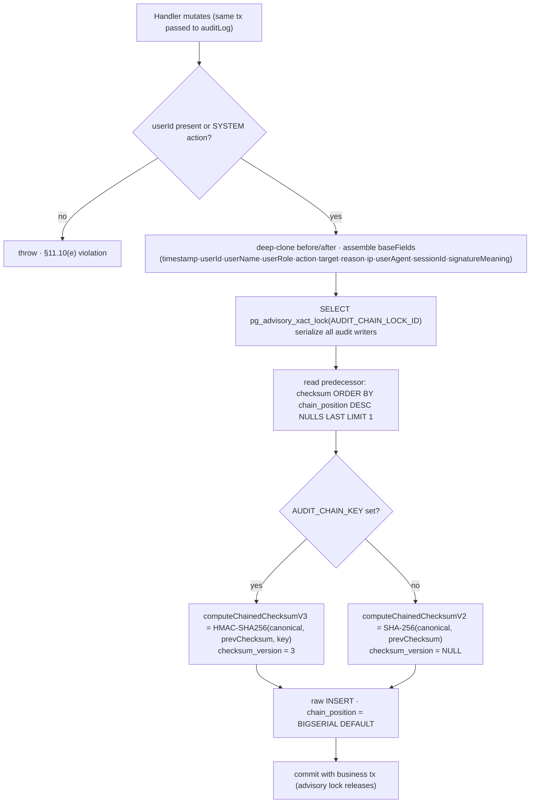

**Checksum math (`lib/hash-chain.ts`):**
- **V1** (`computeChecksum`) sorts top-level keys only. **V2** (`canonicalize`) recursively sorts keys at every depth
  — required because Postgres JSONB re-orders nested keys on read-back. **V3** = HMAC-SHA256 over the V2 canonical
  form with a service-wide secret key.
- `previous_checksum` = the prior row's stored checksum, mixed into the hash input → mutating/inserting/deleting any
  earlier row breaks row N+1's link. `chain_position` is a monotonic BIGSERIAL used as the verification sort key
  (timestamps can collide sub-ms).
- `signatureMeaning` was added to the checksum field set **2026-07-04** → on new rows the signing intent is inside
  the tamper-evidence envelope.
- **`verifyAuditChecksum(record)`** builds both an `expandedFields` set (full) and a legacy `reducedFields` set, and
  accepts a match under V3 (keyed only, no downgrade), V2, or V1, over either set — so historical rows stay
  verifiable across every formula/schema cutover without rewriting immutable history. A **redacted** row is valid
  only if `beforeValue == null && afterValue == null` (a redacted row whose payload "came back" is tampered).
- `getAuditChainKeyedFrom()` (`AUDIT_CHAIN_KEYED_FROM`) is the out-of-band cutover position so a DB actor can't
  downgrade V3 rows to unkeyed.

### 2.2 Read, verify, redact vs delete

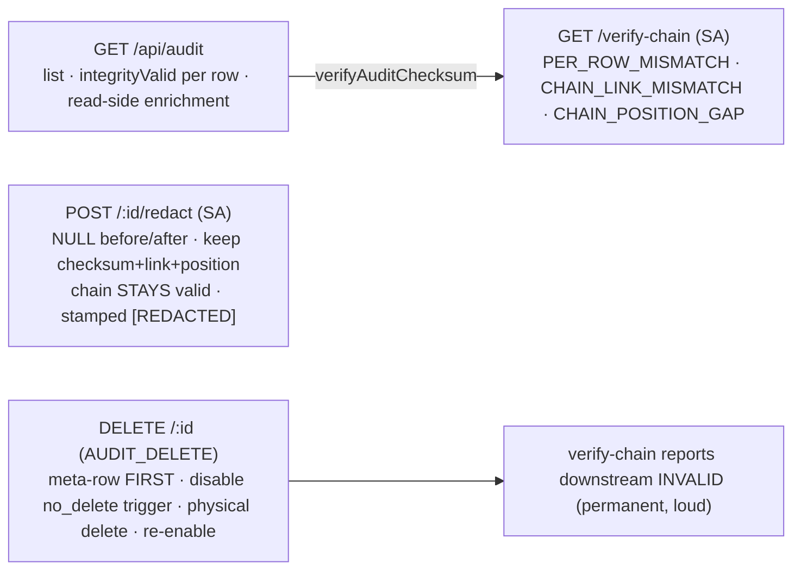

| Method · Path | Gate | Reauth | Purpose |
|---|---|---|---|
| `GET /api/audit` | `AUDIT_READ` | — | filtered list; `integrityValid` per row; enrichment; SA rows hidden from lower roles |
| `GET /api/audit/:id` | `AUDIT_READ` | — | full before/after + checksum + redaction stamps |
| `GET /api/audit/verify-chain` | SUPER_ADMIN | — | walk chain, report anomalies (**API-only, no UI**) |
| `POST /api/audit/:id/redact` | SUPER_ADMIN | REDACT_AUDIT_RECORD | chain-preserving redaction; 409 if already redacted |
| `POST /api/audit/bulk-redact` | SUPER_ADMIN | BULK_REDACT_AUDIT_RECORDS | 1–1000 rows |
| `DELETE /api/audit/:id` | `AUDIT_DELETE` | DELETE_AUDIT_RECORD | physical delete (breaks chain) |
| `POST /api/audit/bulk-delete` | `AUDIT_DELETE` · 5/min | BULK_DELETE_AUDIT_RECORDS | physical bulk delete |
| `POST /api/audit/report-export-log` | authenticated | — | fail-closed `REPORT_GENERATED` row before any client export |

**Immutability & semantics:**
- DB trigger `audit_trail_no_delete` (`prisma/sql/invariants.sql`) raises on any physical delete. The delete
  endpoints query `pg_trigger`, `ALTER TABLE … DISABLE TRIGGER` for the tx window (ACCESS-EXCLUSIVE lock closes the
  window), delete, then re-enable — and write a meta-audit row (`AUDIT_RECORD_DELETED`) recording who/what/why
  **before** the row is destroyed.
- **Redact** (preferred, §11.10(e)-safe): UPDATE nulls the payload, keeps `checksum`/`previous_checksum`/
  `chain_position` → chain intact; FE stamps `[REDACTED by X: reason]`.
- **Hard delete**: leaves a `chain_position` gap → `verify-chain` reports the downstream chain permanently invalid.
  Verify-chain was deliberately **not** taught to tolerate gaps (breakage stays loud).

### 2.3 Read-side enrichment & descriptor rendering

- **Enrichment** (`GET /api/audit`): older rows stored only IDs. Rather than a chain-breaking UPDATE, the handler
  batch-resolves display names (asset instances, cleaning cycles, PM/replacement-schedule entries, redactor
  username) **at read time**; `integrityValid` is still computed against the **original** stored payload.
- **Descriptors** (frontend `audit-helpers.ts → getAuditSummary`): fills `{placeholder}` tokens from per-action
  templates (`audit-templates.ts`, overridable at `/config/audit-templates`). `diffAuditValues` renders old→new
  changed fields, skips UUID keys, and masks `password/secret/token/credential` with `••••••`.

**Key files:** `modules/audit/routes.ts` · `lib/{audit,hash-chain,audit-verify,audit-diff}.ts` ·
`prisma/sql/invariants.sql` · `packages/shared/src/types/{audit-actions,audit-templates}.ts` ·
`apps/web/src/routes/audit/{index.tsx,audit-helpers.ts,components/*}`.

---

## 3. Password policies & expiry

Policy is a keyed blob (`system_config['password-policy']`, def `password-policy.def.ts`). Enforced at every set;
expiry derived at login-time from **live** policy so edits apply retroactively.

### 3.1 Policy fields

Editable in the def: `minLength`(8), `maxLength`(128), `requireUppercase/Lowercase/Numbers/SpecialChars`(true),
`preventReuseCount`, `maxFailedAttempts`(5), `passwordExpiryDays`(90), `expiryNotificationDays`(0). Additional keys
read by the enforcement code (from the Zod schema, not the def UI): `minUppercase/minLowercase/minNumbers/
minSpecialChars`, `cannotBeUserId`, `cannotContainUserId`. Lockout **type/duration** live in the separate
`login-security` blob.

### 3.2 Enforcement, expiry, sweep

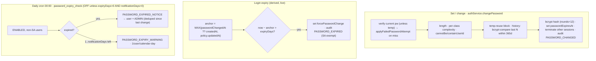

**Grace-period floor.** The anchor is the **later** of (`passwordChangedAt ?? createdAt`) and (`policy.updatedAt`).
Lowering the policy (e.g. 120→1 day) grants everyone a fresh window from the moment the admin saved, instead of
mass-expiring/mass-locking everyone. The legacy `users.password_expires_at` column is deliberately **not** read.
Sweep and login share the same anchor math so warnings and enforcement never disagree.

**Related lockout.** `applyFailedPasswordAttempt` enforces `maxFailedAttempts`; on threshold sets `status=LOCKED`,
audits `ACCOUNT_LOCKED`, notifies. SUPER_ADMIN is lockout-exempt.

| Method · Path | Gate | Reauth |
|---|---|---|
| `GET /api/config/password-policy/current` | any authenticated | — |
| `PUT /api/config/password-policy` | `CONFIG_UPDATE` | UPDATE_PASSWORD_POLICY |
| `POST /api/auth/change-password` | bearer · 5/min | — |
| `POST /api/users/password-expiry-sweep` | `CONFIG_UPDATE` | — |

**Frontend.** Forced-change guard in `app-layout.tsx` (`Navigate to="/change-password"`). `change-password.tsx`
fetches the **public** `/current` policy, mirrors rules as live strength indicators, hides "Current Password" when
`isTemporaryPassword`. Temp passwords generated by `password-utils.ts generatePassword()` using a CSPRNG
(`crypto.getRandomValues` + rejection sampling + Fisher-Yates).

**Key files:** `config/defs/password-policy.def.ts` · `lib/{password,password-expiry}.ts` ·
`modules/auth/{auth.service.ts,password-expiry-sweep.ts}` · `workers/password-expiry.worker.ts` ·
`apps/web/src/routes/auth/change-password.tsx` · `lib/password-utils.ts`.

---

## 4. Re-authentication

Sensitive actions require a fresh password re-verify (§11.200). The `action-reauth` config stores a
`{ ACTION: [roles…] }` map; whether a call needs reauth is a per-role lookup. **This deployment has reauth ON**
(~80/82 actions configured, no SA bypass on config).

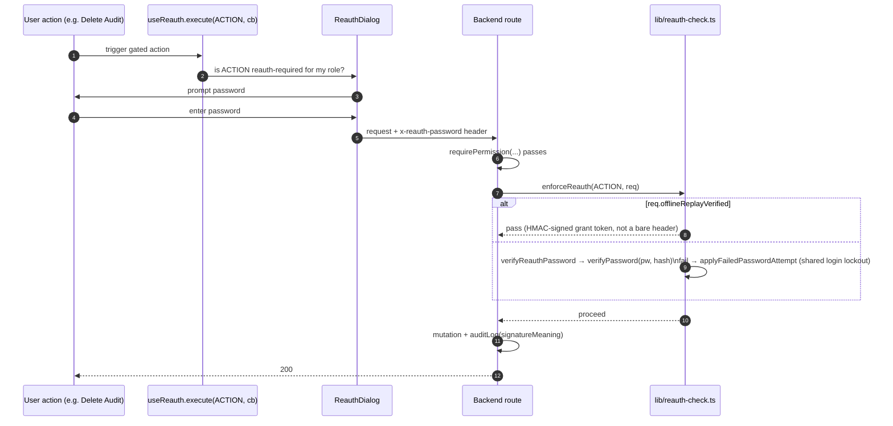

- `enforceReauth` is **config-gated**; `enforceReauthAlways` is **unconditional** (report review/approve, audit
  redact/delete). The password arrives as `_currentPassword` body field or `x-reauth-password` header and is stripped
  from the body after verify.
- **Config-shape defense**: `normalizeActionReauthConfig` rejects a legacy nested shape (returns `{}` and warns) — a
  malformed save turns reauth **off loudly** rather than silently mis-gating. Cache TTL 10s; `updateActionReauth`
  invalidates it. Config page `/config/action-reauth` (SUPER_ADMIN).
- Reauth verification shares the **same lockout accounting** as login, so it is not a non-locking brute-force oracle.

---

## 5. Notifications

In-app notifications are written **synchronously** at event time via `createNotification()` — the queue
`notification` task is a **dead drain** that only ACKs stale jobs. A separate `dispatchNotification()` path handles
external email/SMS/Telegram/Slack delivery. The bell polls an unread count every 30s.

### 5.1 Data model & visibility

`Notification` (table `notifications`): `type` (enum, 30+ values), `title`, `message`, `targetUserId` (who it's
about), `forUserId` (who sees it; null = admins/general), `forRole`, `isRead`, `readAt`, `metadata`, `manualEntry`.
Composite index `(forUserId, isRead, createdAt desc)`.

**Visibility model** (`buildVisibilityFilter`):
- **SUPER_ADMIN** sees everything.
- **ADMIN**: `forUserId=self` OR `forRole='ADMIN'` OR general (both null); explicitly **not** SUPER_ADMIN-addressed
  rows (null-safe: `OR:[{forRole:null},{forRole:{not:'SUPER_ADMIN'}}]` — a bare `NOT` would drop all `forRole IS NULL`
  rows).
- **Other roles**: only `forUserId=self`.
- **Config-gated types** (`GATED_TYPES`): `PM_SCHEDULE_QNN` (config `qnn-notifications.visibleRoles`) and
  `GUEST_CLEANING_REQUEST` (`guest-cleaning-requests.recipientRoles`) bypass normal addressing — visible only to
  roles in their config.

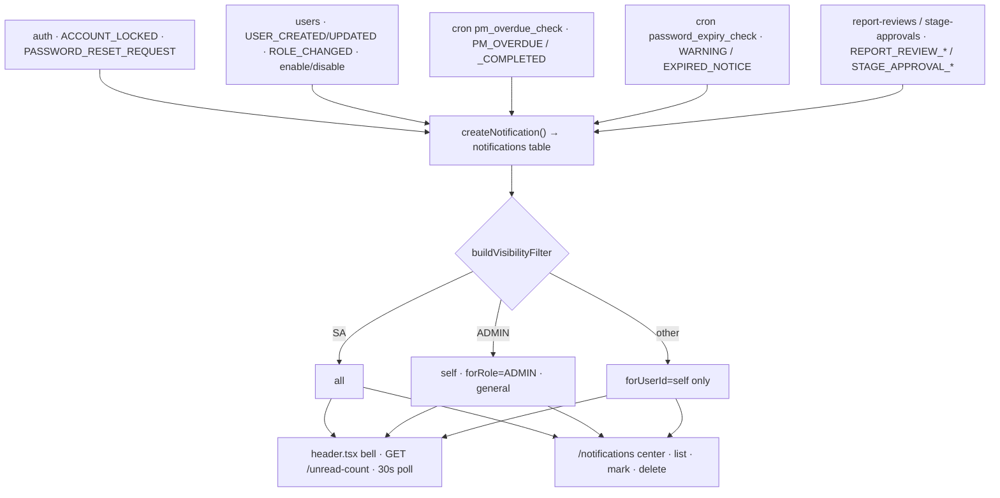

| Method · Path | Gate | Reauth |
|---|---|---|
| `GET /api/notifications` · `/unread-count` | auth (per-user scoped) | — |
| `PUT /…/mark-all-read` · `/bulk-read` · `/bulk-unread` · `/:id/read` · `/:id/unread` | auth | — |
| `DELETE /api/notifications/:id` | `NOTIFICATION_DELETE` | DELETE_NOTIFICATION |
| `POST /api/notifications/bulk-delete` | `NOTIFICATION_DELETE` · 5/min | BULK_DELETE_NOTIFICATIONS |

- **Delete is audited fail-closed**: both delete paths write the `NOTIFICATION_DELETED`/`NOTIFICATIONS_BULK_DELETED`
  audit row inside the same `$transaction` **before** the physical delete — a delete can never commit without its
  record. `bulkDelete` uses `findBulkDeletable` first (since `deleteMany` returns only a count) and mirrors the
  visibility filter (`buildBulkVisibilityFilter`) so admins can't silently under/over-delete.

**Key files:** `modules/notifications/{routes,notification.service,notification.repository}.ts` ·
`workers/{notification.worker,pm-overdue.worker}.ts` · `modules/notification-delivery/notification-dispatcher.ts` ·
`packages/queue/crontab.txt` · `apps/web/src/routes/notifications/index.tsx` · `components/layout/header.tsx`.

---

## 6. Backup & restore

Backups are **ephemeral downloads** — no stored-backup model, no blob store. The table set is dynamic: discovered
from `pg_tables` (excluding `_prisma_migrations`) and topologically sorted by FK dependency (Kahn's algorithm) so
parents insert before children; the reverse order is the FK-safe truncate order.

### 6.1 Export

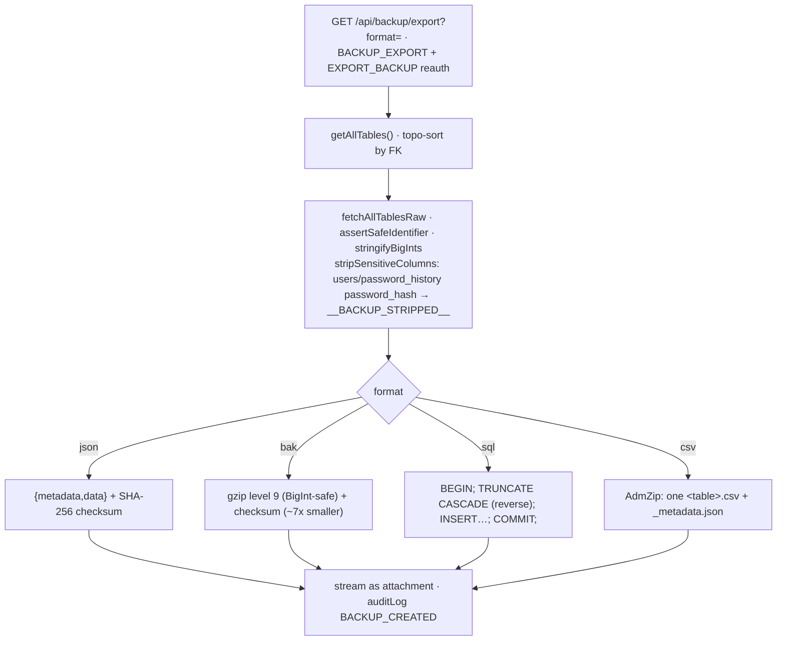

Pre-flight `BACKUP_MAX_ROWS_PER_TABLE` guard (default 500k) throws `BackupTooLargeError` → **413** to avoid OOM.

### 6.2 Restore

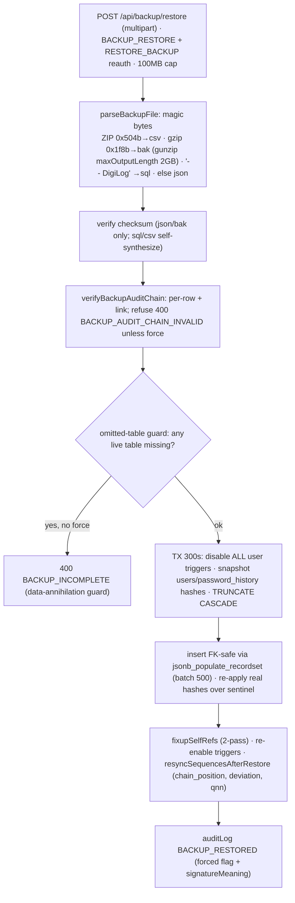

| Method · Path | Gate | Reauth | Purpose |
|---|---|---|---|
| `GET /api/backup/export?format=` | `BACKUP_EXPORT` | EXPORT_BACKUP | generate + stream (json/bak/sql/csv) |
| `POST /api/backup/validate` | `BACKUP_EXPORT` ∨ `BACKUP_RESTORE` | — | dry-run: metadata, per-table counts, checksum state |
| `POST /api/backup/restore` | `BACKUP_RESTORE` | RESTORE_BACKUP | overwrite entire DB |

- `BACKUP_RESTORE` is **not** implied by `BACKUP_MANAGE` (the `_RESTORE` suffix is excluded from the expansion map) —
  it must be granted explicitly. SUPER_ADMIN + ADMIN seed it.
- Restore truncates every table but only repopulates tables present in the file → an incomplete backup (e.g. missing
  `audit_trail`) is refused unless `force`. All user triggers (not just the audit trigger) are disabled during
  restore, else the asset/filter mirror triggers fire and cause duplicate-key rollback (`SET session_replication_role`
  isn't usable — the app DB role isn't superuser).

> **Historical defect (fixed).** Restore was 100% broken **2026-07-04 → 2026-07-15**: a credential-preservation query
> selected a non-existent column `users.password_history_hashes`, raising PG error 42703, which aborts the whole
> transaction (25P02); the surrounding `try/catch` swallowed the JS error but could not un-abort the transaction, so
> every subsequent statement failed and every restore failed. Invisible to unit tests (prisma-mock never hit the real
> column). Fixed in `34b04cf` (probe query selects real columns only; probe queries are now forbidden from being
> wrapped in try/catch), verified with a real export→restore round-trip into a throwaway DB.

**Key files:** `modules/backup/{routes,backup.service,backup.repository,backup.helpers}.ts` ·
`packages/shared/src/types/permissions.ts` · `apps/web/src/routes/config/backup.tsx`.

---

## 7. Configuration system

Def-driven: **36** `defs/*.def.ts` files describe each config surface. `config-discovery.ts` runs once at startup:
statically imports all 36, registers each in `config-registry.ts`, then `seedDefaults()` creates a `system_config`
row per def; also runs one-time migrations (`migrateFilterPmScheduleIntoPmSettings`) and dead-key cleanup
(`offline-sync, rfid-scanner, role-privileges, sidebar-config, uns, retention`).

### 7.1 Definition shape

`ModuleConfigDefinition`: `moduleKey`, `moduleName`, `description`, `icon`, `category`, `sortOrder`,
`permissions:{read,write}`, `requiredRole?`, `requiresReauth`, `reauthAction?`, `settings: SettingDefinition[]`,
`zodSchema?`, `hasCustomPage`/`customPagePath`, `hooks?{afterUpdate,validate,onRead}`. `getManifest(role, perms)`
filters defs by role/read-perm and strips `zodSchema`/`hooks` for the FE.

`SettingDefinition` types (12): `string|number|boolean|secret|select|multiselect|textarea|json|color|url|email|cron`,
plus `default`, `group`, static `options` or `dynamicOptionsSource` (URL fetched by the FE renderer), `maskedInApi`,
`visibleWhen` (conditional), `width`, `helpText`.

### 7.2 Routes & flow

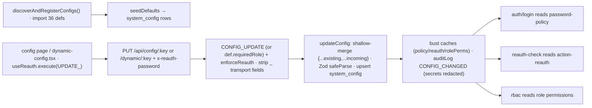

- **Custom-page configs** use `configEndpoint(key, schema, requiresReauth)` (6 typed blobs: `password-policy`,
  `login-security`, `session`, `datetime`, `pagination`, `export-limit`) + **19** `static-routes/*.routes.ts` files.
- **Dynamic configs** (`hasCustomPage:false`) → auto-generated `GET/PUT /api/config/dynamic/:moduleKey` +
  `GET /api/config/registry/manifest`. Gated by `def.requiredRole ? requireRole : requirePermission`.
- **Public reads** (no admin perm): `/password-policy/current`, `/pagination/current`, `/datetime/current`,
  `/export-limit/current`.
- **Partial shallow-merge**: `{...beforeValue, ...sanitized}` so a tab sending only its own fields does not reset the
  others to defaults (array-shaped configs are full replacements). Underscore transport fields (`_currentPassword`)
  are stripped so the reauth password is never persisted.
- **Corrupt-blob fallback**: a stored value that fails Zod re-parses `{}` through the schema to fill `.default()`s —
  NOT `{}` (closes a fail-open where a corrupt `password-policy` would silently disable all rules).
- **Reauth resolution**: `CONFIG_KEY_TO_ACTION` (password-policy→UPDATE_PASSWORD_POLICY, …) + `enforceReauth`. Secret
  keys (`type==='secret'`) redacted from audit before/after via `redactConfigSecrets`.

### 7.3 User / security / notification config defs (all verified present)

| moduleKey | Category | Role | Purpose |
|---|---|---|---|
| `password-policy` | Security | — | length, complexity, reuse, expiry |
| `session` | Security | — | session duration, idle timeout |
| `login-security` | Security | — | lockout type + duration |
| `action-reauth` | Security | **SA** | per-role reauth action map |
| `roles` | User | **SA** | role/permission/sidebar/reauth |
| `user-id` | User | ADMIN | auto-generated User ID format |
| `access-matrix` | Access | **SA** | which roles open which config modules |
| `audit-templates` | Access | **SA** | custom audit description text |
| `field-ids` | Access | **SA** | global field display-name overrides |
| `export-limit` | Access | **SA** | max rows per export + message |
| `report-signatories` | Display | — | per report×role signature label |
| `notification-rules` | Notifications | **SA** | event alerts + recipients |
| `notification-email` / `-sms` | Notifications | **SA** | SMTP / SMS channel config (secrets masked) |
| `qnn-notifications` | Notifications | **SA** | roles allowed to see QNN entries |

**Frontend.** `config/index.tsx` hardcoded `configCards` + `superAdminCards` + a SUPER_ADMIN-only "Additional
Modules" section (manifest-driven). `dynamic-config.tsx` renders settings by type, honoring `visibleWhen` and
`dynamicOptionsSource`. `can-access-module.ts` is **default-deny** for non-SA (card visibility only — endpoints are
independently gated server-side).

> **Known caveats (minor):** `cron` setting type has no dedicated editor widget (falls back to text); the `notIn`
> `visibleWhen` operator is declared but a no-op in the renderer; three separate reauth-action name sources
> (`routes.ts` static map, `dynamic-routes.ts` `UPDATE_<KEY>`, FE override map) are a known drift risk.

**Key files:** `modules/config/{config.service,config.repository,routes,dynamic-routes}.ts` · `defs/*.def.ts` ·
`static-routes/*.routes.ts` · `lib/{config-registry,config-discovery}.ts` ·
`apps/web/src/routes/config/{index,dynamic-config,role-access}.tsx`.

---

## 8. Electronic signatures

There is **no `ElectronicSignature` model** (dropped 2026-07-04). A compliant e-signature is assembled from **three**
live parts: **(a)** re-authentication (password re-verify) as the signing _act_, **(b)** the `signatureMeaning` field
written into the hash-chained audit row as the signing _intent_, **(c)** the `ReportReview`
submit→review→approve workflow carrying signer identity + timestamp on the record itself.

### 8.1 ReportReview model (table `report_reviews`)

`id`, `reportType`, `title`/`subtitle`, `dataSnapshot` (frozen rendered report JSON), `status`
(`PENDING_REVIEW`→`PENDING_APPROVAL`→`APPROVED` / `REJECTED`), `generatedBy`/`generatedByName`/`generatedAt`,
`assigneeUserId`/`assigneeRole` (current-stage assignee — a user OR a whole role), `reviewedBy`/`reviewedByName`/
`reviewedAt`/`reviewRemarks`, `approvedBy`/`approvedByName`/`approvedAt`/`approvalRemarks`,
`rejectionStage`(REVIEW|APPROVAL)/`rejectedBy`/`rejectedByName`/`rejectedAt`. `*ByName` stores the **User ID**
(username).

### 8.2 Signing flow

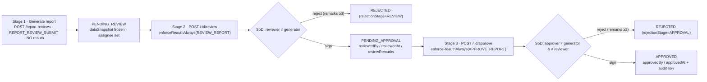

**Workflow controls (`service.ts`):**
- **Separation of duties**: reviewer ≠ generator (`SELF_REVIEW`); approver ≠ generator AND ≠ reviewer
  (`SELF_APPROVE`). SUPER_ADMIN's assignee-bypass does **not** bypass SoD.
- **Assignee enforcement** (`assertIsAssignee`): only the assigned user or role may act.
- **Atomic decide guard** (`decideIfStill`): the status predicate moves into `updateMany WHERE status=expected`;
  concurrent decide → loser gets **409 `CONCURRENT_DECISION`** — a row can never be both APPROVED and REJECTED.
- **Remarks mandatory on reject** (≥3 chars, both stages); optional on approve.

| Method · Path | Gate | Reauth |
|---|---|---|
| `POST /api/report-reviews` | `REPORT_REVIEW_SUBMIT` | — (unsigned) |
| `GET /api/report-reviews/queue` · `/` · `/:id` | any review perm | — |
| `POST /api/report-reviews/:id/review` | `REPORT_REVIEW` | **always** REVIEW_REPORT |
| `POST /api/report-reviews/:id/approve` | `REPORT_APPROVE` | **always** APPROVE_REPORT |

### 8.3 signatureMeaning strings (composed per call site — no enum)

| Action | signatureMeaning |
|---|---|
| REPORT_REVIEW_SUBMITTED | `Report "<title>" submitted for review` |
| REPORT_REVIEW_REVIEWED | `Report "<title>" reviewed (sent for approval)` |
| REPORT_REVIEW_APPROVED | `Report "<title>" approved` |
| REPORT_REVIEW_REJECTED | `Report "<title>" rejected at review / at approval` |
| REPORT_GENERATED | `<user> generated the <type> report (<n> record(s)) as <fmt>` |
| audit redact/delete | `Audit record <id> payload redacted; chain link preserved` / `… PHYSICALLY DELETED; hash chain broken` |

### 8.4 PDF signature manifestation (§11.50) — `apps/web/src/lib/pdf-report.ts`

`addEndBlock` renders at the bottom of the last page: a hand-fill Remarks box, optional Legend, the signature
line(s), and `Printed Date & Time: <printedAt>`. For an **approved** re-download, `reviewSignatures()` replaces the
single line with `Printed By: <generatedByName>` / `Reviewed By: <reviewedByName>` / `Approved By: <approvedByName>`.
`report-signatories` config maps role×reportKey → label; the printed value is always the actor's User ID.

### 8.5 21 CFR Part 11 signature requirements — honest verdicts

| Requirement | How met | Verdict |
|---|---|---|
| §11.200 unique to individual / two components | Username + password re-verified at each act; session ties to login | **Partial** — only password re-presented at sign time |
| §11.50(a)(3) signature meaning | `signatureMeaning` in audit + PDF label | **Partial** — stored & checksummed but **never rendered in the audit UI** |
| §11.70 link to record | Same DB row (`*By/*At`) + hash-chained audit; `dataSnapshot` frozen at submit | **Met** procedurally (FK + chain, not a per-signature digest) |
| Non-repudiation | Hash chain (+ optional keyed HMAC), SoD, atomic decide, lockout | **Partial** — rests on password secrecy + DB integrity, not a signer key |

> **Compliance gaps to flag.** (1) **No cryptographic per-user signing key / PKI** — signing is a bcrypt password
> comparison; there is no artifact only the signer could produce. Non-repudiation depends on password confidentiality
> + the (optionally HMAC-keyed) audit chain, whose key is a single service-wide `AUDIT_CHAIN_KEY`, not per-user.
> (2) `signatureMeaning` is **invisible in the web UI** (0 references in `apps/web/src`) — a §11.50 display gap.
> (3) **Stage-1 "Printed By" is not reauth-signed** — only review & approve require a password. (4) The PDF prints
> the **print** timestamp, not the sign timestamp, and omits the meaning string. (5) No controlled vocabulary for
> meanings (free-text sentences); historical rows aren't tamper-covered for the field (reduced-field fallback).

**Key files:** `modules/report-reviews/{routes,service}.ts` · `schema.prisma → model ReportReview` ·
`lib/{reauth-check,audit,hash-chain}.ts` · `config/defs/report-signatories.def.ts` ·
`apps/web/src/routes/report-reviews/index.tsx` · `lib/{pdf-report,report-review}.ts`.

---

## 9. Verification matrix — auditor proof

Each capability confirmed against live code with a source anchor. Verified **2026-07-18** on branch `RFID`. Real gaps
are listed honestly.

### RBAC & permissions

| Capability | Status | Evidence |
|---|---|---|
| 102 permission constants | ✅ verified | `permissions.ts` (grep = 102) |
| 83 privileges · 92 reauth · 27 sidebar items | ✅ verified | counts match; `legacy-maps-derived.test.ts:52` |
| PERMISSION_TREE single source; maps derived + frozen-snapshot drift lock | ✅ verified | `permission-tree.ts:873`, `legacy-maps-derived.test.ts` |
| `_MANAGE`→CRUD & `_VIEW`←`_READ`; `_RESTORE` excluded | ✅ verified | `permissions.ts:225-264` |
| 4 decorators + SUPER_ADMIN bypass | ✅ verified | `rbac.ts:58,93,121,142,66` |
| Role-perms cache 5s · auth cache 30s + invalidation | ✅ verified | `rbac.ts:31`, `auth.ts:102,151` |
| Escalation guard on role create/update | ✅ verified | `role.service.ts:23,262,301` |
| User-management hierarchy guard (no higher role, no self-role-change) | ✅ verified | `user.service.ts:24,180` |
| Roles CRUD; custom-role delete blocks if users assigned | ✅ verified | `roles/routes.ts`, `role.service.ts:353` |
| Grant rebuild (permissions full-rebuild vs sidebar additive) | ✅ verified | `config.service.ts:176-214` |
| Per-user override precedence (user > role config) | ✅ verified | `config.service.ts:284-294` |
| Frontend `useCan` gating (20 files) + `RequireRole` | ✅ verified | `use-can.ts:24`, `require-role.tsx` |
| **System roles cannot be deleted** | ⚠️ **GAP** | schema says so, **no `isSystem` check** in `role.service.ts:346` / `role.repository.ts:95` |
| **Role-delete respects caller hierarchy** | ⚠️ **GAP** | `delete()` never calls `assertRoleWithinCallerPrivilege` (`role.service.ts:346`) |

### Configuration

| Capability | Status | Evidence |
|---|---|---|
| 36 config defs · 34 config pages | ✅ verified | `ls defs/*.def.ts` = 36 |
| Discovery imports all 36 + seedDefaults + dead-key cleanup | ✅ verified | `config-discovery.ts:12,64,78` |
| Registry + manifest (role/perm filtered) | ✅ verified | `config-registry.ts:62,133` |
| 12 setting types + visibleWhen + maskedInApi + dynamicOptionsSource | ✅ verified | `config-registry.ts:6-20,43,51` |
| configEndpoint typed blobs (6) + dynamic routes + manifest | ✅ verified | `routes.ts:143`, `dynamic-routes.ts` |
| 4 public `/current` reads | ✅ verified | `routes.ts:151-187` |
| 19 custom-page config surfaces | ✅ verified | `static-routes/*.routes.ts` |
| Partial shallow-merge + `_`-field strip | ✅ verified | `config.service.ts:89,103` |
| Corrupt blob → schema defaults (not `{}`) | ✅ verified | `config.service.ts:71` |
| Reauth resolution + secret redaction in audit | ✅ verified | `routes.ts:35`, `config.service.ts:15` |
| All 15 user/security/notification defs exist | ✅ verified | each `defs/<name>.def.ts` |
| Default-deny config-card access for non-SA | ✅ verified | `can-access-module.ts:29` |
| `cron` type no widget; `notIn` operator no-op | ⚠️ minor | `dynamic-config.tsx:42,396` |

---

## 10. 21 CFR Part 11 coverage

| § Control | Mechanism | Where |
|---|---|---|
| §11.10(d) limit access to authorized individuals | RBAC gates + escalation guards; backup strips password hashes | `rbac.ts`, `role/user.service.ts` |
| §11.10(e) audit trail of operator entries | Transactional `auditLog` requires actor; before/after/reason/timestamp | `lib/audit.ts` |
| §11.10(c)/(e) protect records; no unauthorized deletion | `audit_trail_no_delete` trigger + hash chain + verify-chain | `invariants.sql`, `hash-chain.ts` |
| §11.10(g) authority checks | Per-action permission gates + reauth; password expiry (SA-exempt) | `rbac.ts`, `reauth-check.ts` |
| §11.50 signature manifestations | `signatureMeaning` in audit + PDF block · ⚠️ UI display gap | `audit.ts`, `pdf-report.ts` |
| §11.70 signature–record linking | ReportReview `*By/*At` + hash-chained audit target | `report-reviews/service.ts` |
| §11.100 uniqueness of signatures | Unique username + single-active-session · ⚠️ no PKI | `auth.service.ts` |
| §11.200 signature components & controls | Password re-verify at signing + separation of duties | `reauth-check.ts`, `report-reviews` |
| §11.300 identification-code / password controls | Policy (length/complexity/reuse/expiry), lockout, forced change | `password-policy.def.ts`, `auth.service.ts` |

> **Standing gaps (be candid with the reviewer):** no per-user cryptographic signing key; `signatureMeaning` not
> surfaced in the audit UI; two RBAC delete-path guards missing. None block day-to-day operation; all warrant a
> remediation ticket.

---

## 11. Cross-cutting libraries

| Library | Role | Path |
|---|---|---|
| Auth gate | JWT verify, session lifecycle, forced-change & expiry enforcement | `plugins/auth.ts` |
| RBAC gate | requirePermission/Any/Role/SuperAdmin, 5s role-perms cache | `plugins/rbac.ts` |
| Re-auth | enforceReauth / enforceReauthAlways over action-reauth config | `lib/reauth-check.ts` |
| Audit | transactional write + advisory-lock hash-chain construction | `lib/audit.ts` · `lib/hash-chain.ts` |
| Password | bcrypt hash/verify (rounds 12), expiry anchor math | `lib/password.ts` · `lib/password-expiry.ts` |
| Shared truth | PERMISSION_TREE derives every permission & reauth map | `packages/shared/src/types/*` |

> **How the tiers agree.** The SPA gates buttons with `useCan('<node-id>')` against the same `PERMISSION_TREE` gate
> the backend enforces with `requirePermission` — FE visibility and BE authorization never drift; a frozen-snapshot
> test (`legacy-maps-derived.test.ts`) locks zero drift.

---

*DigiLog architecture reference · scope: 21 CFR Part 11 identity, compliance & administration surface
(filter-operations excluded) · every endpoint, gate, model field and file path verified against branch `RFID` at
generation time (2026-07-18).*
